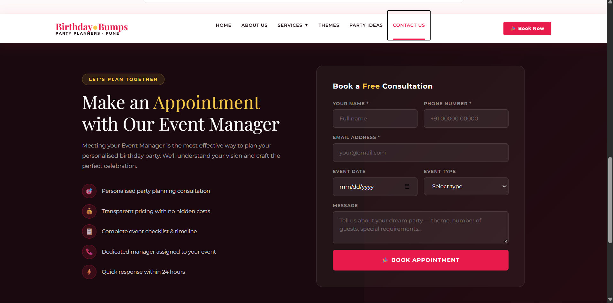
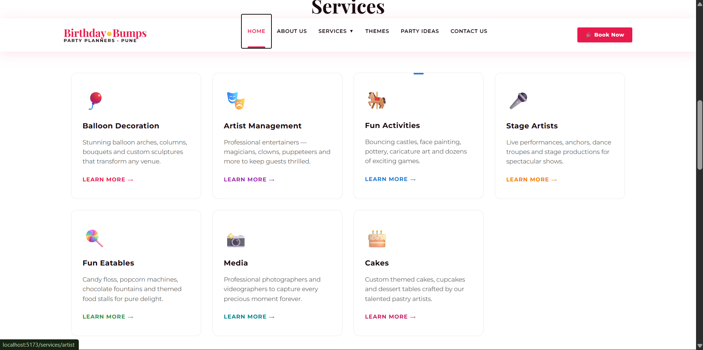
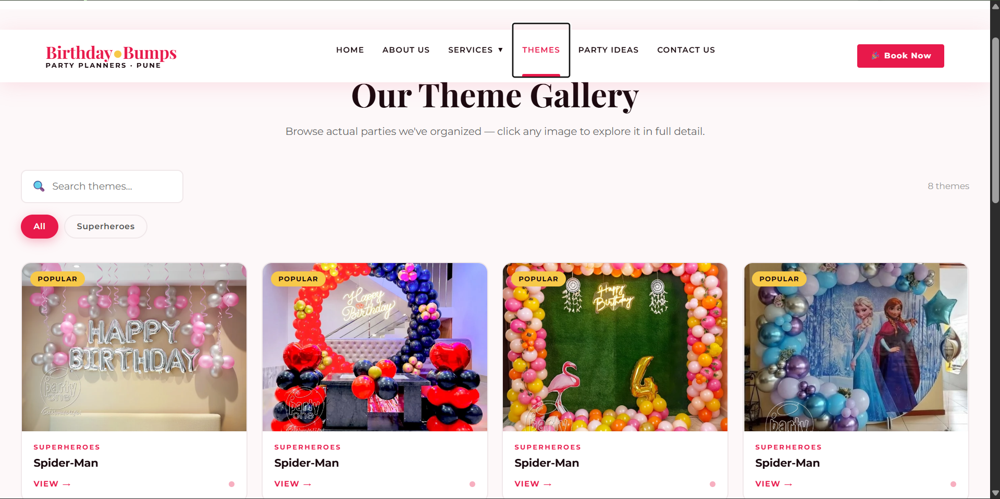
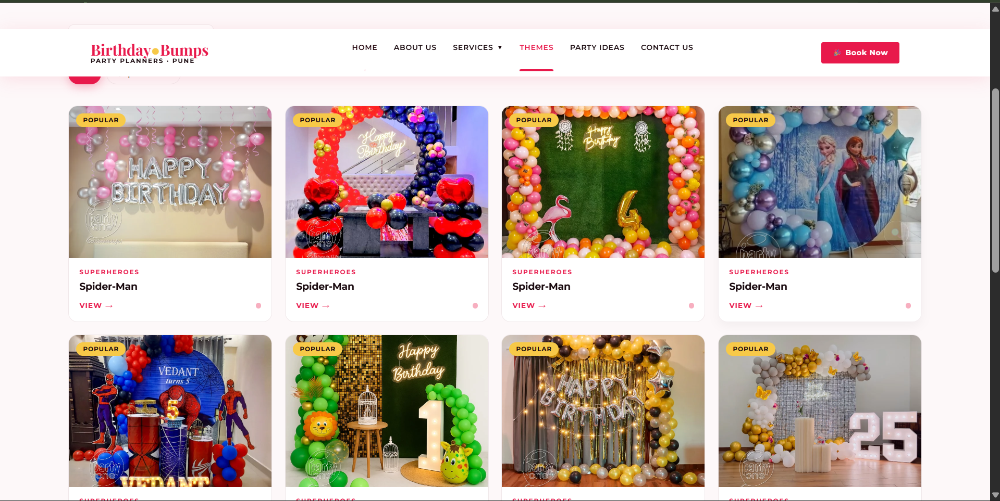

# 🎂 Birthday Event Management System

A full-stack web application for managing and booking birthday events. The system allows users to explore birthday event services, select themes, and submit appointment/booking requests through a simple and responsive interface.

## 🚀 Live Demo

[Birthday Event Management — Live Website](https://birthday-event-management-1kv2.onrender.com)

## 📌 Features

* 🎉 Birthday event booking system
* 📝 Appointment/booking form
* 🎨 Multiple birthday themes
* 🛍️ Birthday event services
* 📋 Manage customer booking details
* 🔗 RESTful API for handling bookings
* 💾 MongoDB database integration
* 📱 Responsive user interface
* ⚡ React-based frontend
* 🌐 CORS configuration for frontend-backend communication
* ☁️ Deployed using Render

---

## 🛠️ Technologies Used

### Frontend

* React.js
* Vite
* JavaScript
* HTML
* CSS
* Bootstrap

### Backend

* Node.js
* Express.js
* REST API
* CORS

### Database

* MongoDB
* MongoDB Atlas

### Deployment

* Render

---

## 📂 Project Structure

```text
Birthday-Event-Management/
│
├── frontend/
│   ├── src/
│   │   ├── components/
│   │   ├── pages/
│   │   ├── App.jsx
│   │   └── main.jsx
│   │
│   ├── public/
│   ├── package.json
│   └── vite.config.js
│
├── backend/
│   ├── models/
│   ├── routes/
│   ├── controllers/
│   ├── server.js
│   ├── package.json
│   └── .env
│
├── screenshots/
│   ├── Appointment.png
│   ├── Home.png
│   ├── Services.png
│   ├── Theme1.png
│   └── Theme2.png
│
└── README.md
```

> The exact folder structure may vary depending on the current version of the project.

---

## ⚙️ Installation and Setup

### 1. Clone the Repository

```bash
git clone https://github.com/Dhiraj-jagdale45/Birthday-Event-Management.git
```

Navigate to the project directory:

```bash
cd Birthday-Event-Management
```

---

## 🖥️ Frontend Setup

Navigate to the frontend folder:

```bash
cd frontend
```

Install dependencies:

```bash
npm install
```

Start the development server:

```bash
npm run dev
```

---

## 🔧 Backend Setup

Navigate to the backend folder:

```bash
cd backend
```

Install dependencies:

```bash
npm install
```

Create a `.env` file in the backend directory:

```env
MONGODB_URI=your_mongodb_connection_string
PORT=5000
```

Start the backend server:

```bash
npm start
```

Or, if using nodemon:

```bash
npm run dev
```

---

## 🔗 API

The backend provides REST APIs for managing birthday event appointments.

### Create Appointment

```http
POST /api/appointments
```

Example request:

```json
{
  "name": "John Doe",
  "email": "john@example.com",
  "phone": "9876543210",
  "date": "2026-10-15",
  "eventType": "Birthday Party"
}
```

The submitted booking information is stored in MongoDB.

---

## 🗄️ Database

This project uses **MongoDB Atlas** as the cloud database.

The application stores booking/appointment information such as:

* Customer name
* Email
* Phone number
* Event date
* Event type
* Other booking details

The MongoDB connection string is stored securely in the `.env` file.

> **Note:** Never commit your `.env` file to GitHub.

---

# 📸 Screenshots

## 🏠 Home Page


---

## 📅 Appointment / Booking Page



---

## 🎉 Services Page



---

## 🎈 Birthday Theme 1



---

## 🎂 Birthday Theme 2



---

## 🔄 Application Flow

```text
        User
          │
          ▼
   React Frontend
          │
          │ HTTP Request
          ▼
   Express.js API
          │
          ▼
    MongoDB Atlas
          │
          ▼
   Booking Information
```

---

## 🌐 Deployment

The application is deployed using **Render**.

### Frontend

The React/Vite application is deployed as a web service/static site.

### Backend

The Node.js/Express API is deployed separately and communicates with the MongoDB Atlas database.

The frontend uses the deployed backend API URL to send booking requests.

---

## 🔮 Future Improvements

* 🔐 User authentication and authorization
* 👤 User dashboard
* 📅 Advanced event scheduling
* 💳 Online payment integration using Razorpay
* 📧 Email confirmation for bookings
* 🔔 Booking status notifications
* 🧑‍💼 Admin dashboard
* 📊 Booking management and analytics
* 🔍 Search and filter functionality

---

## 🎯 Learning Outcomes

Through this project, I gained practical experience in:

* Building full-stack web applications
* Developing REST APIs using Express.js
* Connecting Node.js applications with MongoDB
* Creating reusable React components
* Managing frontend and backend communication
* Handling CORS
* Working with environment variables
* Deploying applications on Render
* Using Git and GitHub for version control

---

## 👨‍💻 Author

**Dhiraj Jagdale**

### GitHub

[GitHub Profile](https://github.com/Dhiraj-jagdale45)

---

## ⭐ Support

If you find this project useful, consider giving the repository a ⭐ on GitHub.
